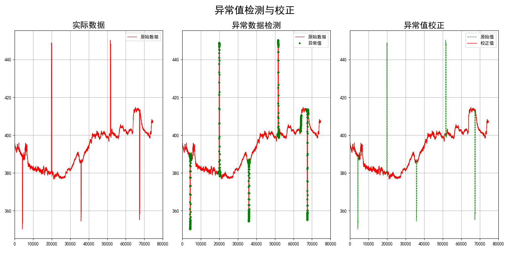

[TOC]

# TF-IDF

- TF-IDF（term frequency–inverse document frequency）是一种==用于信息检索与数据挖掘的常用加权技术==。TF意思是词频(Term Frequency)，IDF意思是逆文本频率指数(Inverse Document Frequency)。

  - **词频 (term frequency, TF)**  指的是某一个给定的词语在该文件中出现的**次数**。这个数字通常会被归一化(一般是词频除以文章总词数), 以防止它偏向长的文件。（同一个词语在长文件里可能会比短文件有更高的词频，而不管该词语重要与否。）
  - **逆向文件频率 (inverse document frequency, IDF)**  IDF的主要思想是：如果包含**词条t**的文档越少, IDF越大，则说明词条具有很好的**类别区分能力**。某一特定词语的IDF，可以由**总文件数目**除以**包含该词语之文件的数目**，再将得到的商取对数得到。

- TF-IDF是一种统计方法，用以评估一字词对于一个文件集或一个语料库中的其中一份文件的重要程度。字词的重要性随着它在文件中出现的次数成正比增加，但同时会随着它在语料库中出现的频率成反比下降。

- TF-IDF加权的各种形式常被==搜索引擎应用==，作为文件与用户查询之间相关程度的度量或评级。

- ==公式==

  ## 

  - 
  - 
  - 

- [编程解释](https://www.cnblogs.com/pinard/p/6693230.html)

  ```python
  import pandas as pd
  import numpy as np
  from sklearn.feature_extraction.text import TfidfVectorizer,CountVectorizer,HashingVectorizer,TfidfTransformer
  # lolfish
  corpus=["I come to China to travel", 
      "This is a car polupar in China",          
      "I love tea and Apple ",   
      "The work is to write some papers in science"] 
  tfidf2 = TfidfVectorizer()
  re = tfidf2.fit_transform(corpus)
  
  print(re)
  print(tfidf2.get_feature_names())
  ```

   输出：

    (0, 4)	0.4424621378947393
    (0, 15)	0.697684463383976
    (0, 3)	0.348842231691988
    (0, 16)	0.4424621378947393
    (1, 3)	0.3574550433419527
    (1, 14)	0.45338639737285463
    (1, 6)	0.3574550433419527
    (1, 2)	0.45338639737285463
    (1, 9)	0.45338639737285463
    (1, 5)	0.3574550433419527
    (2, 7)	0.5
    (2, 12)	0.5
    (2, 0)	0.5
    (2, 1)	0.5
    (3, 15)	0.2811316284405006
    (3, 6)	0.2811316284405006
    (3, 5)	0.2811316284405006
    (3, 13)	0.3565798233381452
    (3, 17)	0.3565798233381452
    (3, 18)	0.3565798233381452
    (3, 11)	0.3565798233381452
    (3, 8)	0.3565798233381452
    (3, 10)	0.3565798233381452
  ['and', 'apple', 'car', 'china', 'come', 'in', 'is', 'love', 'papers', 'polupar', 'science', 'some', 'tea', 'the', 'this', 'to', 'travel', 'work', 'write']

  解释：（0，4）代表第0个句子（共四个句子：0，1，2，3），第4个关键词（China）的TF-IDF值。

# 缺省值填充

```python
import numpy as np
from sklearn.preprocessing import Imputer

X = [
    [2, 2, 4, 1],
    [np.nan, 3, 4, 4],
    [1, 1, 1, np.nan],
    [2, 2, np.nan, 3]
]

Imputer(missing_values=’NaN’, strategy=’mean’, axis=0, verbose=0, copy=True)

imp1.fit(X)
```

==主要参数说明：==

1. **missing_values：**缺失值，可以为整数或NaN(缺失值numpy.nan用字符串‘NaN’表示)，默认为NaN

2. **strategy：**替换策略，字符串，默认用均值‘mean’替换
   - 若为mean时，用特征列的**均值**替换
   - 若为median时，用特征列的**中位数**替换
   - 若为most_frequent时，用特征列的**众数**替换

3. **axis：**指定轴数，默认axis=0代表列，axis=1代表行

4. **copy：**设置为True代表不在原数据集上修改，设置为False时，就地修改。

# 哑编码

- OneHotEncoder
- DictVectorizer
- FeatureHasher

## OneHotEncoder：独热编码

- 在分类和聚类运算中我们经常==计算两个个体之间的距离==，对于连续的数字（Numric）这一点不成问题，但是对于名词性（Norminal）的类别，计算距离很难。即使将类别与数字对应，例如{‘A’，‘B’，‘C’}与[0,1,2]对应，我们也不能认为A与B，B与C距离为1，而A与C距离为2。独热编码正是为了处理这种距离的度量，该方法认为每个类别之间的距离是一样的。该方法将类别与向量对应，==例如{‘A’，‘B’，‘C’}分别与[1,0,0],[0,1,0],[0,0,1]对应==，注意现在各个类别之间的欧式距离是相同的。
- 该函数在 `sklearn.preprocessing` 类中，格式为：

```python
OneHotEncoder(n_values=’auto’,  categorical_features=’all’,  dtype=<class ‘numpy.float64’>,  sparse=True,  handle_unknown=’error’)
```

- 例子：

  ```python
  data=np.array([[1,0,3.25],
                 [0,0,5.2],
                 [2,1,3.6]])
  enc=OneHotEncoder(categorical_features=np.array([0,1]),n_values=[3,2])
  enc.fit(data)
  data=enc.transform(data).toarray()
  print(data)
  ```

  ```
  输出：
  [[0.   1.   0.   1.   0.   3.25]
   [1.   0.   0.   1.   0.   5.2 ]
   [0.   0.   1.   0.   1.   3.6 ]]
  ```

  

  - 原data需要竖着看，第一列为[1,0,2]一共有三个元素，因此编码0 = 【1，0，0】，1=【0，1，0】，2 =【0，0，1】，为输出data各个行的前3个元素。
  - 输出data第4、5个元素为原data第二列【0，0，1】的编码【0，1】，【1，0】
  - 输出data的第三列为原浮点数
  - 参数：
    - **categorical_features**：指需要编码的列，这里是第0和第1列
    - **n_values**：指每一列的类别数目，第一列为3个，第二列为2个，第三列因为不需要编码所以没有设置。

  若把上面改为

  ```
  enc=OneHotEncoder(categorical_features=np.array([0,1,2]))
  ```

  指的是第三列也需要编码，则系统输出

  ```
  [[0. 1. 0. 1. 0. 1. 0.]
   [1. 0. 0. 1. 0. 0. 1.]
   [0. 0. 1. 0. 1. 1. 0.]]
  ```

  可见==编码只对整数有效，对浮点数会转换为整数之后再统计，也就是对于3.25和3.6默认都是3，也就是同一类。==

## DictVectorizer：字典特征提取器

- 将字典数据结构向量化
- 类别类型特征借助原型特征名称采用0 1 二值方式进行向量化
- 数值类型特征保持不变

```python
from sklearn.feature_extraction import DictVectorizer

# 定义一个字典列表 用来表示多个数据样本
measurements = [
    {"city": "Dubai", "temperature": 33.0},
    {"city": "London", "temperature": 12.0},
    {"city": "San Fransisco", "temperature": 18.0},
]

# 初始化字典特征抽取器
vec = DictVectorizer()
data = vec.fit_transform(measurements).toarray()
# 查看提取后的特征值
print(data)
'''
[[ 1.  0.  0. 33.]
 [ 0.  1.  0. 12.]
 [ 0.  0.  1. 18.]]
'''
# 查看提取后特征的含义
print(vec.get_feature_names())
'''
['city=Dubai', 'city=London', 'city=San Fransisco', 'temperature']
'''
```

## FeatureHasher：特征哈希

在机器学习中，特征哈希也称为==哈希技巧==（类比于核技巧），是一种==简单的降维方法== 。

*特征哈希法的目标是把原始的高维特征向量压缩成较低维特征向量，且尽量不损失原始特征的表达能力。*

# 二值化

```python
import numpy as np
from sklearn.preprocessing import Binarizer

arr = np.array([
    [1.5, 1.3, 1.9],
    [0.5, 0.5, 1.6],
    [1.1, 2.1, 0.2]
])
# 以1为界
binarizer = Binarizer(threshold=1.0).fit(arr)
binarizer.transform(arr)
```

```
输出：
array([[ 1.,  1.,  1.],
       [ 0.,  0.,  1.],
       [ 1.,  1.,  0.]])
```

# 标准化

计算公式：

> z = (x - u) / s

　　其中u是训练样本的均值，如果with_mean=False,则为0

　　s是训练样本的标准偏差，如果with_std=False,则为1

```python
from sklearn.preprocessing import StandardScaler
X = [
    [1, 2, 3, 2],
    [7, 8, 9, 2.01],
    [4, 8, 2, 2.01],
    [9, 5, 2, 1.99],
    [7, 5, 3, 1.99],
    [1, 4, 9, 2]
]
ss = StandardScaler(with_mean=True, with_std=True)
ss.fit(X)
print ss.mean_
# [ 4.83333333  5.33333333  4.66666667  2.        ]
print ss.n_samples_seen_
# 6
print ss.scale_
# [ 3.07769755  2.13437475  3.09120617  0.00816497]
print ss.transform(X)
'''
 [[-1.24551983 -1.56173762 -0.53916387  0.        ]
 [ 0.70398947  1.2493901   1.40182605  1.22474487]
 [-0.27076518  1.2493901  -0.86266219  1.22474487]
 [ 1.3538259  -0.15617376 -0.86266219 -1.22474487]
 [ 0.70398947 -0.15617376 -0.53916387 -1.22474487]
 [-1.24551983 -0.62469505  1.40182605  0.        ]]
'''

```

# 区间缩放法

公式：

X_std = (X - X.min(axis=0)) / (X.max(axis=0) - X.min(axis=0)) ;

X_scaler = X_std/ (max - min) + min

数据在最大和最小值中间。

```python
import numpy as np
from sklearn.preprocessing import MinMaxScaler
X = np.array([
    [1, -1, 2, 3],
    [2, 0, 0, 3],
    [0, 1, -1, 3]
], dtype=np.float64)
# 最大值为5，最小值为1
scaler = MinMaxScaler(feature_range=(1,5))
scaler.fit(X)
print(scaler.transform(X))
'''
[[ 3.          1.          5.          1.        ]
 [ 5.          3.          2.33333333  1.        ]
 [ 1.          5.          1.          1.        ]]
'''
```

# 归一化

```python
sklearn.preprocessing.Normalizer(norm=’l2’, copy=True)
```

**norm：**可以为l1、l2或max，默认为l2

- 若为l1时，样本各个特征值除以各个特征值的绝对值之和

- 若为l2时，样本各个特征值除以各个特征值的平方之和

- 若为max时，样本各个特征值除以样本中特征值最大的值

```python
import numpy as np
from sklearn.preprocessing import Normalizer
X = np.array([
    [1, -1, 2],
    [2, 0, 0],
    [0, 1, -1]
], dtype=np.float64)
normalizer1 = Normalizer(norm='max')
normalizer2 = Normalizer(norm='l2')
normalizer1.fit(X)
normalizer2.fit(X)
print normalizer1.transform(X)
print "----------------------------------"
print normalizer2.transform(X)
'''
[[ 0.5 -0.5  1. ]
 [ 1.   0.   0. ]
 [ 0.   1.  -1. ]]
----------------------------------
[[ 0.40824829 -0.40824829  0.81649658]
 [ 1.          0.          0.        ]
 [ 0.          0.70710678 -0.70710678]]
'''
```

# 多项式转换 TODO

PolynomialFeatures

# 特征选择/降维

```python
import numpy as np
from sklearn.feature_selection import VarianceThreshold,SelectKBest
from sklearn.feature_selection import f_regression
from sklearn.feature_selection import chi2
from sklearn.feature_selection import RFE
from sklearn.feature_selection import SelectFromModel
from sklearn.linear_model import LogisticRegression
from sklearn.svm import SVR
from sklearn.ensemble import GradientBoostingClassifier

X = np.array([
    [0, 2, 0, 3],
    [0, 1, 4, 3],
    [0.1, 1, 1, 3]
], dtype=np.float64)
Y = np.array([1,2,1])
```

## 过滤式（filter）

### 方差选择法

- 计算该==列方差==，如果过于小了那说明没有变化
- 使用方差选择法，先要计算各个特征的方差，然后根据阈值，==选择方差大于阈值的特征。==

```python
variance = VarianceThreshold(threshold=0.1)
variance.fit(X)
print variance.transform(X)
'''
第一行2和0方差大于阈值
[[ 2.  0.]
 [ 1.  4.]
 [ 1.  1.]]
'''
```

### 相关系数法

使用相关系数法，先要==计算各个特征对目标值的相关系数以及相关系数的P值==。用feature_selection库的SelectKBest类结合相关系数来选择特征的代码如下：

```python
from sklearn.feature_selection import SelectKBest
from scipy.stats import pearsonr

#选择K个最好的特征，返回选择特征后的数据
#第一个参数为计算评估特征是否好的函数，该函数输入特征矩阵和目标向量，输出二元组（评分，P值）的数组，数组第i项为第i个特征的评分和P值。在此定义为计算相关系数
#参数k为选择的特征个数
SelectKBest(lambda X, Y: array(map(lambda x:pearsonr(x, Y), X.T)).T, k=2).fit_transform(iris.data, iris.target)
```

可选关联系数、卡方校验、最大信息系数作为得分计算的方法

- **SelectKBest**选择排名排在前n个的变量 
- **SelectPercentile** 选择排名排在前n%的变量 
- **其他指标:** false positive rate SelectFpr, false discovery rate SelectFdr, or family wise error SelectFwe 和 GenericUnivariateSelect。

**对于regression问题：**用f_regression函数。 
**对于classification问题：**用chi2或者f_classif函数。 

```python
# 对每一行选出TOP2的特征
sk1 = SelectKBest(f_regression, k=2)
sk1.fit(X, Y)
print sk1
print sk1.scores_
print sk1.transform(X)
'''
SelectKBest(k=2, score_func=<function f_regression at 0x000000000A8A4BA8>)
[  0.33333333   0.33333333  16.33333333          nan]
[[ 2.  0.]
 [ 1.  4.]
 [ 1.  1.]]
'''
```


## 包裹式
- 它与过滤式不同，它会考虑后续的学习器。它会把==学习器的性能==作为评价准则。

- 从最终的学习器性能来看，包裹式特征选择比过滤式特征选择更好。但是另一方面，由于在特征选择过程中需多次训练学习器，因此包裹式特征选择的==计算开销通常要大得多==。

### LVW

- 第一步：随机选出特征集；

- 第二步：计算==相关误差==，如果误差比原本的小，或者误差相当但是特征数比之前的少，则把子集留下。

### 递归式特征消除(RFE)

- 第一步：对初始特征进行训练，==得到权重==（例如线性模型的系数）
- 第二步：==剔除权重最小的特征==，构成新的集合
- 第三步：不断重复，知道满足停止条件（达到所需要的特征数量）为止。

```python
estimator = SVR(kernel='linear')
selector = RFE(estimator, 2, step=1)
selector = selector.fit(X, Y)
print selector.support_
print selector.n_features_
print selector.ranking_
print selector.transform(X)
'''
[False  True  True False]
2
[2 1 1 3]
[[ 2.  0.]
 [ 1.  4.]
 [ 1.  1.]]
'''
```

函数：

```
sklearn.feature_selection.RFE(estimator,n_features_to_select=None,step=1,estimator_params=None,verbose=0)
```

**参数：**

1. **estimator:**一个学习器（通常使用SVM和广义线性模型作为estimator）
2. **n_features_to_select:**指定要选出几个特征
3. **step:**指定每次迭代要剔除权重最小的几个特征
   - 大于等于1：指定每次迭代要剔除权重最小的特征的==数量==
   - 在0.0~1.0：指定每次迭代要剔除权重最小的特征的==比例==
4. **estimator_params:**一个字典，用于设定estimator的参数

sklearn还提供了**RFECV类**，它是RFE的一个变体，它==执行一个交叉验证来寻找最优的剩余特征数量，因此不需要指定保留多少个特征==。原型为

```
sklearn.feature_selection.RFECV(estimator,step=1,cv=None,scoring=None,estimator_params=None,verbose=0)
```


## 嵌入式

- 训练基模型，选择权值系数较高的特征
- 有些机器学习方法本身就具有对特征进行打分的机制，或者很容易将其运用到特征选择任务中，例如回归模型，SVM，决策树，随机森林等等。
- **SelectFromModel** 作为meta-transformer，能够用于拟合后任何拥有`coef_`或`feature_importances_` 属性的预测模型。 如果==特征对应的`coef_` 或 `feature_importances_` 值低于设定的阈值==`threshold`，那么这些特征将被移除。除了手动设置阈值，也可通过字符串参数调用内置的启发式算法(heuristics)来设置阈值，包括：平均值(“mean”), 中位数(“median”)以及他们与浮点数的乘积，如”0.1*mean”。

### 基于L1的特征选择

- ==使用L1范数作为惩罚项的线性模型(Linear models)会得到稀疏解：大部分特征对应的系数为0。==当你希望减少特征的维度以用于其它分类器时，可以通过 `feature_selection.SelectFromModel` 来==选择不为0的系数。==
- 特别指出，==常用于此目的的稀疏预测模型有 `linear_model.Lasso`（回归）， `linear_model.LogisticRegression` 和 `svm.LinearSVC`（分类）:==

```python
X2 = np.array([
    [ 5.1,  3.5,  1.4,  0.2],
    [ 4.9,  3. ,  1.4,  0.2],
    [ -6.2,  0.4,  5.4,  2.3],
    [ -5.9,  0. ,  5.1,  1.8]
], dtype=np.float64)
Y2 = np.array([0, 0, 2, 2])
estimator = LogisticRegression(penalty='l1', C=0.1)
sfm = SelectFromModel(estimator)
sfm.fit(X2, Y2)
print sfm.transform(X2)
'''
[[ 5.1]
 [ 4.9]
 [-6.2]
 [-5.9]]
'''
```

- *对于SVM和逻辑回归，==参数C控制稀疏性：C越小，被选中的特征越少。==对于==Lasso，参数alpha越大，被选中的特征越少。==*

### 随机稀疏模型 (Randomized sparse models)

　　**基于L1的稀疏模型的局限在于，当面对一组互相关的特征时，它们只会选择其中一项特征。为了减轻该问题的影响可以使用随机化技术，通过_多次重新估计稀疏模型来扰乱设计矩阵_，或通过_多次下采样数据来统计一个给定的回归量被选中的次数_。**——==稳定性选择 (Stability Selection)==

　　RandomizedLasso 实现了使用这项策略的Lasso，RandomizedLogisticRegression 使用逻辑回归，适用于分类任务。要得到整个迭代过程的稳定分数，你可以使用 `lasso_stability_path`。

　　注意到对于非零特征的检测，要使随机稀疏模型比标准F统计量更有效， 那么模型的参考标准需要是稀疏的，换句话说，非零特征应当只占一小部分。

### 基于树的特征选择 (Tree-based feature selection)

　　基于树的预测模型（见 sklearn.tree 模块，森林见 sklearn.ensemble 模块）能够用来==计算特征的重要程度，因此能用来去除不相关的特征==（结合 `sklearn.feature_selection.SelectFromModel`）:

```python
>>> from sklearn.ensemble import ExtraTreesClassifier
>>> from sklearn.datasets import load_iris
>>> from sklearn.feature_selection import SelectFromModel
>>> iris = load_iris()
>>> X, y = iris.data, iris.target
>>> X.shape
(150, 4)
>>> clf = ExtraTreesClassifier()
>>> clf = clf.fit(X, y)
>>> clf.feature_importances_  
array([ 0.04...,  0.05...,  0.4...,  0.4...])
>>> model = SelectFromModel(clf, prefit=True)
>>> X_new = model.transform(X)
>>> X_new.shape               
(150, 2)
```

### 将特征选择过程融入pipeline

特征选择常常被当作学习之前的一项预处理。在scikit-learn中推荐使用
`sklearn.pipeline.Pipeline`:

```python
clf = Pipeline([
  ('feature_selection', SelectFromModel(LinearSVC(penalty="l1"))),
  ('classification', RandomForestClassifier())
])
clf.fit(X, y)
```

- 在此代码片段中，将　sklearn.svm.LinearSVC 和 sklearn.feature_selection.SelectFromModel 结合来评估特征的重要性，并==选择最相关的特征==。之后 sklearn.ensemble.RandomForestClassifier 模型使用转换后的输出训练，即==只使用被选出的相关特征==。你可以选择其它特征选择方法，或是其它提供特征重要性评估的分类器。

| 包                  | 类或方法     | 说明                       |
| :------------------ | :----------- | :------------------------- |
| sklearn.pipeline    | Pipeline     | 流水线处理                 |
| sklearn.pipeline    | FeatureUnion | 并行处理                   |
| sklearn.grid_search | GridSearchCV | 网格搜索自动化调参         |
| externals.joblib    | dump         | 数据持久化                 |
| externals.joblib    | load         | 从文件系统中加载数据至内存 |

## 正则化的特征选择方法

### 岭回归

- 针对高方差，即过拟合的模型，解决办法之一就是对模型进行==正则化：限制参数大小==。
- 当线性回归过拟合时，权重系数$w_j$就会非常的大，岭回归就是要解决这样的问题。
- 岭回归（Ridge Regression）可以理解为在线性回归的损失函数的基础上，加,入一个L2正则项，来限制W不要过大。其中λ>0，通过确定λ的值可以使得模型在偏差和方差之间达到平衡，随着λ的增大，模型的方差减小，偏差增大。


- 我们可以像线性回归一样，利用最小二乘法求解岭回归模型的参数：


*岭回归没有特征选择功能*

### Lasso

- Lasso回归和岭回归类似，不同的是，Lasso可以理解为在线性回归基础上加入一个==L1正则项，同样来限制W不要过大。==其中λ>0，通过确定λ的值可以使得模型在偏差和方差之间达到平衡，随着λ的增大，模型的方差减小，偏差增大。
- Lasso趋向于使得一部分w值变为0，所以可以作为特征选择用，因为这里的L1正则项并不是处处可导的，所以并不能直接使用基于梯度的方法优化损失函数，若要从底层实现，可以使用拟牛顿法的BFGS算法，逐步向前回归。
- Lasso由于使用L1正则项，所以具有一定的特征选择功能，因为L1正则倾向于产生稀疏，它可以将一些“对标签没有用处”的特征对应的系数压缩为0，进而将对结果有较大影响的特征突显出来，而==岭回归中L2正则项不具备这个功能，它只会将一些无关特征的系数降到一个较小的值，但不会降为0。==并且L2正则有解析解，L1没有，所以还有一种对岭回归和Lasso折中的方法——弹性网络（Elastic Net）：


# 异常数据处理

```python
### 异常数据处理
data = pd.read_csv(path2, header=0)
x = data[filename].values

width = 300
delta = 5
eps = 0.02
N = len(x)
p = []
# 异常值存储
abnormal = []
for i in np.arange(0, N-width, delta):
    s = x[i:i+width]
    ## 获取max-min的差值
    min_s = np.min(s)
    ptp = np.ptp(s) 
    ptp_min = ptp / min_s
    p.append(ptp_min)
    ## 如果差值大于给定的阈值认为是
    if ptp_min > eps:
        abnormal.append(range(i, i+width))
## 获得异常的数据x值        
abnormal = np.array(abnormal).flatten()
abnormal = np.unique(abnormal)
#plt.plot(p, lw=1)
#plt.grid(b=True)
#plt.show()

plt.figure(figsize=(18, 7), facecolor='w')
plt.subplot(131)
plt.plot(x, 'r-', lw=1, label=u'原始数据')
plt.title(u'实际数据', fontsize=18)
plt.legend(loc='upper right')
plt.xlim(0, 80000)
plt.grid(b=True)

plt.subplot(132)
t = np.arange(N)
plt.plot(t, x, 'r-', lw=1, label=u'原始数据')
plt.plot(abnormal, x[abnormal], 'go', markeredgecolor='g', ms=3, label=u'异常值')
plt.legend(loc='upper right')
plt.title(u'异常数据检测', fontsize=18)
plt.xlim(0, 80000)
plt.grid(b=True)

# 预测
plt.subplot(133)
select = np.ones(N, dtype=np.bool)
select[abnormal] = False
t = np.arange(N)
## 决策树
dtr = DecisionTreeRegressor(criterion='mse', max_depth=10)
br = BaggingRegressor(dtr, n_estimators=10, max_samples=0.3)
## 模型训练
br.fit(t[select].reshape(-1, 1), x[select])
## 模型预测得出结果
y = br.predict(np.arange(N).reshape(-1, 1))
y[select] = x[select]
plt.plot(x, 'g--', lw=1, label=u'原始值')    # 原始值
plt.plot(y, 'r-', lw=1, label=u'校正值')     # 校正值
plt.legend(loc='upper right')
plt.title(u'异常值校正', fontsize=18)
plt.xlim(0, 80000)
plt.grid(b=True)

plt.tight_layout(1.5, rect=(0, 0, 1, 0.95))
plt.suptitle(u'异常值检测与校正', fontsize=22)
plt.show()
```



**处理步骤**：

1. 通过粗略处理确定异常值：
   - 每隔一小步（5）获取长段（300）区间，计算当前区间最大最小值之差（np.ptp），除区间最小值
   - 如果大于阈值，则认为当前区间为异常值区间。
2. 进行异常值的预测：
   - 不是异常值的为训练样本，输入非异常值样本的x值（1，2，3等），输出样本的y值。
   - 预测为，按x顺序输入，输出模型预测值，记录为y。
   - 将y所有之前测试非异常值的都改为原始y值，其他按照预测情况来。
